<div align="center">

<br/>
<div align="center">
  
</div>

[](https://git.io/typing-svg)

<br/>

[](https://www.linkedin.com/in/mulia-andiki-030457331)
[](mailto:email-muliaandiki@gmail.com)
[](https://github.com/MuliaAndiki)
[](https://www.tiktok.com/@dikzzycde)


</div>

---

## 〉whoami

```typescript
const mulia: Engineer = {
  role: "Full Stack Engineer",
  location: "Banda Aceh, Aceh — Indonesia 🇮🇩",
  education: "Software Engineering @ Universitas Syiah Kuala (6th sem)",
  runtime: ["Bun", "ElysiaJS", "Next.js", "Docker", "Coolify"],
  editor: "Vscode on Ubuntu Linux",
  interests: ["IoT Systems", "Computer Vision", "AI/ML", "System Design"],
  currentFocus: "Building Fluxo · NutriPlate · AERIS · Simlo",
};
```

I build production-grade systems at the intersection of **AI, IoT, and real-time infrastructure** — from voice-driven smart home pipelines to computer vision–powered monitoring platforms. My engineering practice is grounded in ownership: understanding not just how code works, but why it exists and how it fails.

---

## 〉tech-stack

### Languages


### Frontend


### Backend & Runtime


### Data & Infrastructure


### AI / ML


---

## 〉git log --stats

<div align="center">


</div>

<div align="center">


</div>

---

## 〉current focus

```
PID   PROCESS                  CPU    STATUS
───────────────────────────────────────────────
001   Fluxo (smart home)       ████   running
002   NutriPlate (CV + IoT)    ████   running
003   AERIS (env dashboard)    ███░   running
004   Simlo (road damage AI)   ██░░   building
005   Apple Dev Academy 2027   █░░░   applying
```

<p align="center">

> _"The best engineers are not those who write the most code,_  
> _but those who write the least code necessary to solve the right problem."_

</p>

